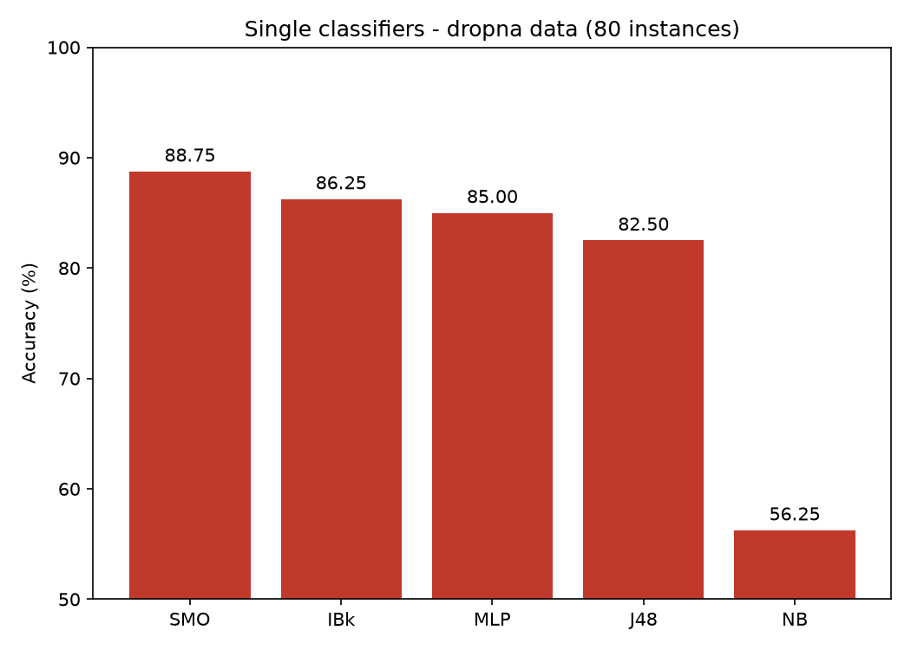
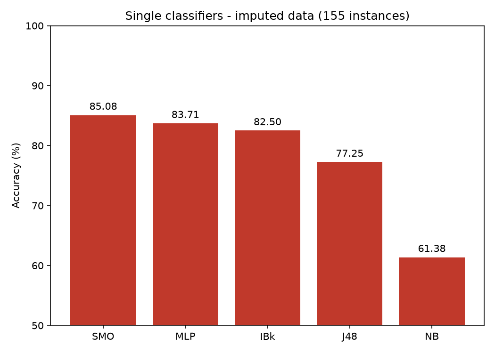
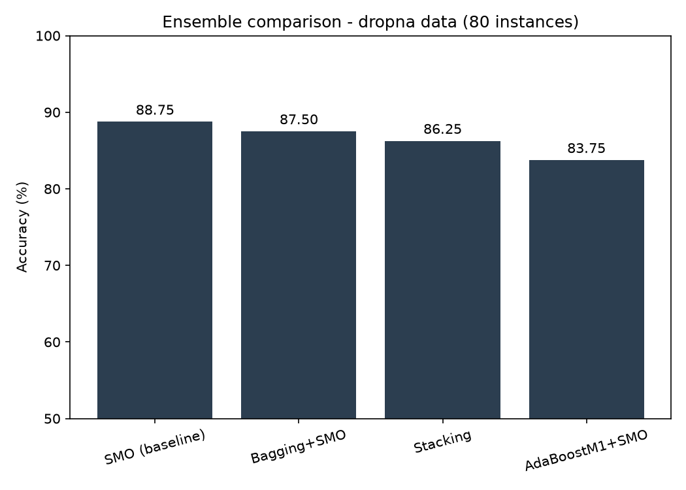
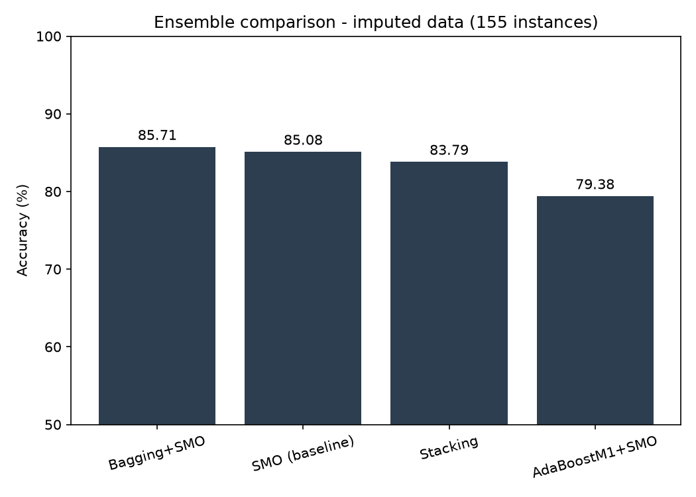

# Results comparison

Reproduction of Rosly et al. (2018), "Analyzing performance of classifiers for
medical datasets", using scikit-learn instead of WEKA, on the Hepatitis
dataset only.

## Single classifiers

| Classifier | Paper (WEKA, n=155*) | This repo, dropna (n=80) | This repo, imputed (n=155) |
|---|---|---|---|
| NB   | 81.25% | 56.25% | 61.38% |
| J48  | 81.25% | 82.50% | 77.25% |
| MLP  | 82.50% | 85.00% | 83.71% |
| SMO  | 80.00% | 88.75% | 85.08% |
| IBk  | 81.25% | 86.25% | 82.50% |

Note the wider swing in NB's accuracy compared to the imputed version below is a visible effect of training on only 80 patients instead of 155.

 
*The paper does not state its post-cleaning sample size; it only says rows
with missing values were dropped from the original 155.

## Ensembles (best base classifier only)

| Combination | Paper | This repo, dropna | This repo, imputed |
|---|---|---|---|
| Bagging + base   | 85.00% (bagging+MLP) | 87.50% (bagging+SMO) | 85.71% (bagging+SMO) |
| Boosting + base  | 83.75% (AdaBoost+MLP) | 83.75% (AdaBoost+SMO) | 79.38% (AdaBoost+SMO) |
| Stacking + base  | 86.25% (stacking+MLP) | 86.25% (stacking) | 83.79% (stacking) |

Note on stacking: the paper builds "stacking" from a single repeated base classifier through WEKA's Vote meta-classifier. This repo instead uses the standard definition of stacking: combining several different classifiers (SVM, MLP, k-NN) under a logistic regression meta-learner. Numbers are not directly comparable for that row.

## What differs from the paper, and why

### Missing data

The paper drops every row with a missing value. For this dataset it proves to be a costly factor. PROTIME alone is missing in 67 of 155 rows, so the revised dataset is just reduced down to 80 instances. This repo produces both versions so that the effect of "cleaning" is directly visible. Models trained on 80 rows swing much more between runs, and NB's accuracy in particular changes by 5 points between the two versions.

### Metrics

The paper reports accuracy only. Given the class imbalance in the dataset (123 LIVE vs. 32 DIE), accuracy alone can be misleading. A model that always predicts LIVE would score close to 80% while never catching a DIE case. This repo also reports on precision, recall, F1, and ROC-AUC per classifier (see 'single_classifiers_-.csv').

### Statistical testing

The paper reports raw accuracy differences without testing whether they are meaningful. This repo runs a paired t-test between each ensemble's fold-wise accuracy scores and the base classifier's scores. On the imputed dataset, none of the bagging, boosting, or stacking beat the single SMO classifier at p < 0.05, with AdaBoost showing significantly worse accuracy scores at a value of p = 0.043. It suggests the paper's reported gains from ensembling may not hold up as reliable improvements on this dataset size.

## Takeaway

The conclusion at hand shows that the paper's findings replicate: esembling gives, at best, a modest bump overr the single best classifier on this dataset, and that bump is not guaranteed to be statistically meaningful given how small the dataset is after "cleaning". The specific best classifier differs (SMO here vs. MLP in the paper), which is expected as the switch from WEKA to scikit-learn's default hyperparameters and cross-validation splits.